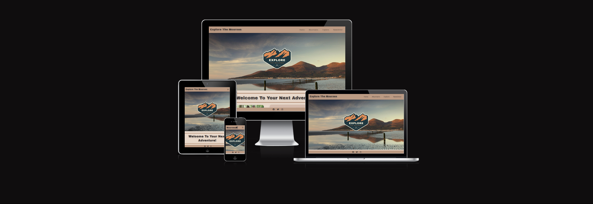
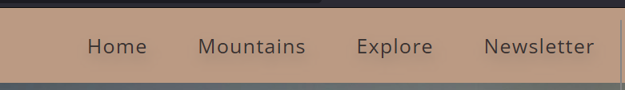
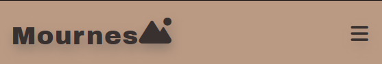
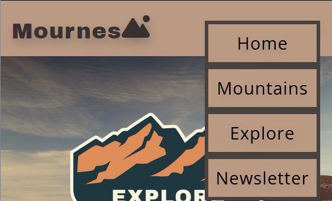
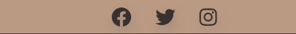

 # Explore The Mournes

Explore The Mournes is a website that informs users about the Mourne Mountain area and what it can offer to anyone wanting to explore and visit. The website gives the visitor information on seven of the highest peaks of the Mournes, and other distinct places to discover in the surrounding areas. The site also has information on three of the most popular places to go mountain biking. It also offers a subscription to an e-newsletter that keeps you up-to-date on organised events in the peaks, as well as a monthly photography competition with the winners featured each month. View the live site <a href="https://jamieb92.github.io/milestone-project-one/" target=" _blank">here.</a>

## Features 

# Site wide
 ### Navigation Menu
  * Contains Links to Home, Mountains, Explore and Newsletter. The nav bar is responsive on all devices, on smaller screens it turns in to a drop-down menu for ease of use on a smaller device.
  * This allows for ease of navigation through the site no matter the device it is being viewed on.

   Larger Screens:
    
    
 
   Mobile Screens:
   
    
 
   Drop-down:
    
    
 
 ### Footer
  * The footer contains social media icons that are linked to the social media websites. When the user clicks on the icon it will open a new tab and take the  user to the correct social media platform. 
  * This allows the user the ability to follow and join the Explore The Mourne community on their desired platform. It also allows the user to keep informed on any events coming up and allowing the user another platform to enter the monthly competition. 
  * For a user who is using a screen reader the icons contain the aria label for accessibility. 
 
  

# Home Page 
### Hero Image & Logo
 * When the vistor first arrives on the page they will first see the Explore The Mournes logo and the hero image of the Mourne mountains.
 * The hero Image is fixed in place, this will animate the home page.
 * This will allow the user to know what the website is about and draw the user to explore the site.
 
 