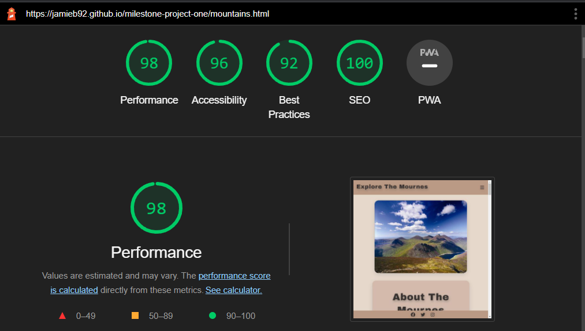

 # Explore The Mournes

Explore The Mournes is a website that informs users about the Mourne Mountain area and what it can offer to anyone wanting to explore and visit. The website gives the visitor information on seven of the highest peaks of the Mournes, and other distinct places to discover in the surrounding areas. The site also has information on three of the most popular places to go mountain biking. It also offers a subscription to an e-newsletter that keeps you up-to-date on organised events in the peaks, as well as a monthly photography competition with the winners featured each month. View the live site <a href="https://jamieb92.github.io/milestone-project-one/" target=" _blank">here.</a>

# Site wide
 ### Navigation Menu
  * Contains Links to Home, Mountains, Explore and Newsletter. The nav bar is responsive on all devices, on smaller screens it turns in to a drop-down menu for ease of use on a smaller device.
  * This allows for ease of navigation through the site no matter the device it is being viewed on.

   Larger Screens:
    
    
 
   Mobile Screens:
   
    
 
   Drop-down:
    
    
 
 ### Footer
  * The footer contains social media icons that are linked to the social media websites. When the user clicks on the icon it will open a new tab and take the  user to the correct social media platform. 
  * This allows the user the ability to follow and join the Explore The Mourne community on their desired platform. It also allows the user to keep informed on any events coming up and allowing the user another platform to enter the monthly competition. 
  * For a user who is using a screen reader the icons contain the aria label for accessibility. 
 
  

# Home Page 
### Hero Image & Logo
 * When the vistor first arrives on the page they will first see the Explore The Mournes logo and the hero image of the Mourne mountains.
 * The hero Image is fixed in place, this will animate the home page.
 * This will allow the user to know what the website is about and draw the user to explore the site. 
 
 

 ### Explore & Visit The Mournes
* This gives the user information about why they should visit and explore the Mournes.
* This allows the user to be informed and engaged with the site and the Mourne area.  
 

# Mountains Page
 * This gives the user information on the Mourne Mountains. 
 * As the user scorlls down the page they will find unique information about the 7 highest peaks in the Mournes. 
 * Within each section this will give the user information on where to park/start the hike and how long it will take. 
 * Each image is accessible for the visually impared giving each image a descriptive alt attribute. 
  
 

# Explore Page
* This page offers an alternative to the user than hiking. 
* Each section within this page gives the user other information about unique places and activities within the Mourne Mountain region. 
* The Mourne Wall section gives the user information on the Mourne wall and its history. 
* Silent Valley section offers the user information on the area and what facilities it has to offer to the user. 
* Within the Mountain Bike section of this page it tells you where the popular places are, what type of trails are there and the facilities they offer. 
 

# E-Newsletter Page
* This page allows the user to sign up to the monthly E-Newsletter.
* Subscribing offers the user an opportunity to win in a monthly photography competition and also informs the user of active groups and events.
* The subscription form allows the user to subscribe and upload photos at the same time.
* The subscription form consists of the following inputs:
  * First Name
  * Last Name
  * Date of Birth
  * Email Address
  * Reasons for Subscribing
  * Upload For Competition
  * Subscribe Button
  * Reset Button
* Once subscribed the user will be directed to thankyou.html giving the user a thank you message for subscribing.
* The user will be able to navigate out of the page through the navigation menu. 
 
 

# Technologies Used 

* <a href="https://en.wikipedia.org/wiki/HTML5" target=" _blank">HTML 5</a>
* <a href="https://en.wikipedia.org/wiki/CSS" target=" _blank">CSS 3</a>
* <a href="https://www.gitpod.io/" target=" _blank">Gitpod</a>
* <a href="https://github.com/" target=" _blank">GitHub</a>
* <a href="https://git-scm.com/" target=" _blank">Git</a>
* <a href="https://fontawesome.com/" target=" _blank">Font Awesome</a>
* <a href="https://fonts.google.com/about" target=" _blank">Google Fonts</a>
* <a href="https://convertio.co/jpg-webp/" target=" _blank">Convertio</a>
* <a href="https://tinypng.com/" target=" _blank">Tinypng</a>
* <a href="https://grammarly.com" target=" _blank">Grammarly</a>

# Testing 

### Mobie Devices Used For Testing:
* Iphone 13 pro Max 
* Ipad 8th Gen 

#### Desktop
* I tested that each page on the site works on:
 * Chrome
 * Firefox
 * Edge 

 ### Mobile
 * I tested that each page on the site works on :
  * Chrome
  * Firefox 
  * Safari

### Functions  
* I have confirmed that all links within the nav bar work and take the user to the correct page.
  * I have tested this by clicking on each link and making sure it opens the correct page.

* I have confirmed that the website is responsive with different screen sizes. 
  * I tested this by using different mobile devices and using the devtools within the browser to re-create different screen sizes.

* I have confirmed that the navigation menu title and text are all readable. They are all clear and easy to understand. 
   * I have tested this through lighthouse. 

* I have confirmed all external links open in a new tab and direct the user to the external site.
  * I have tested this by clicking on each link and checking it opens a new tab which goes to the correct external site. 

* I have confimed the footer icons are all readable and clear to understand and that they go to the correct site.
  * I have tested this by clicking on the social media icons which open a new tab/app to the correct site.

* I have confirmed that the subscription form is responsive and working on all devices.
  * I have tested this by using the devtools to change the screen size, I also checked it worked on two mobile devices.

* I have confirmed that the input is only required for personal information but not for reasons for subscribing and uploading photos for the monthly competition.
  * I have tested this by not adding an input to the required fields and click subscribe. As expected please "fill in this field" appears after clicking subscribe

* I have confirmed that the subscribe button works and takes the user to the thankyou.html page.
  * I have tested this by adding all the correct inputs into the form and clicked subscribe which took me to the the thankyou.html page.

* I have confirmed that the reset button works with the form.
   * I have tested this by adding inputs to the form and then clicking reset. The inputs are reset as expected.

### Solved Bugs
 * During validation testing I discovered my best performance score was lower on some of the pages.
 * I discovered this was because my image files were too large.
 * I resolved the issue by compressing the images and converting certain images to .webp files. 

### Unfixed bugs 
 * During testing on different mobile browsers I found that when viewing the site on Safari mobile brower you must hold the menu icon for a second before the drop down apears.
 * This does not happen on other mobile browsers tested. This is a Safari issue with reading CSS.
 * In normal circumstances, Javascript can be used to create the dropdown menu.

### Validator Testing 

* HTML 
 * No errors were returned when passing through the official W3C validator.
* CSS 
 * No errors were found when passing through the offficial (Jigsaw) validator.

 ### Lighthouse Testing 

* I have confirmed that on each page, the colours and fonts of the site were chosen to be easy to read and accessible by running it through lighthouse in devtools.
 * index.html:
  

 * mountains.html:
  
  

* explore.html:
 
 

*  newsletter.html :
 
  

# Deployment 

* Explore The Mournes was deployed using GitHub pages:
 * Within the repository, go to settings.
 * Scroll down to Pages.
 * Select the Main branch.
 * Click save.
 * Page will refresh once site is published. 
 * It will now show the live active site.
 
 The live link to Explore the Mournes can be found at: 
 https://jamieb92.github.io/milestone-project-one/

 # Credits

 ## Content:
* Love Running project
* https://www.w3schools.com
* https://css-tricks.com/snippets/css/a-guide-to-flexbox/
* https://color.adobe.com/
* https://fontawesome.com/
* https://fonts.google.com
* https://rgbacolorpicker.com/
* https://app.grammarly.com/

All images that have been used are credited to their owners and the links to the images can found below. 

### Index.html:

* https://www.flickr.com/photos/makeart67/48803676491/in/photolist-2hmBAJ8-28FDauo-NMCPPG-pjNUJM-2hDGpx9-LV92cA-PRCk4u-ei5k4A-H42wv2-RJB6WG-2naVRYP-icqGSg-Gwpmb1-mp8ZnD-2m83jLG-axs5bK-NeQfdF-LWzVkx-21n1hqF-2j7tbBV-2i4mUWX-2naXfTa-t93hYC-2nannid-2iGh9bP-bjRqF5-V4WdhE-2dNqDd4-2kHfyPx-MQ9q6-2nNyhZa-29p3D7a-2m7Zsrb-S6bN1m-2iKNVnc-LEHUHk-RZFksQ-NCQSVU-2kCeoZv-NSZ9BR-2kPnEkz-2grksrN-zHpRcF-DRbXEc-ajrFoR-P3Wbfi-2keXkAB-2ntADaw-2nK4yWA-2kKCMxQ

* https://www.pexels.com/photo/traveling-diverse-males-walking-in-forest-5064903/

* https://www.pexels.com/photo/clear-footed-glass-beside-bowl-370984/

### mountains.html:
#### Content
* https://en.wikipedia.org/wiki/Mourne_Mountains
* https://trekni.com/2020/10/27/hiking-the-mournes-big-eight/
* https://en.wikipedia.org/wiki/Slieve_Donard
* https://www.summitpost.org/slieve-donard/923635
* https://en.wikipedia.org/wiki/Slieve_Commedagh
* https://www.mudandroutes.com/routes/walk-up-slieve-commedagh-via-glen-river/
* https://en.wikipedia.org/wiki/Slieve_Binnian
* https://www.mudandroutes.com/routes/walk-up-slieve-bearnagh/
* https://niexplorer.com/latest/slieve-bearnagh-mourne-mountains
* https://www.mourne-mountains.com/mournes/mountains/slievelamagan/
* https://www.theirishroadtrip.com/slieve-meelmore-and-meelbeg-walk/

#### Images
* https://www.flickr.com/photos/32071882@N02/9131322803/in/photolist-eUUq94-qHGYNj-BFVKcp-4ptoFo-CvuAPL-9xvh4s-oZN1tM-zLVpUR-9fiwni-faHpq-Fo85g9-P6fS7n-7QPQQ3-oNUSbN-74XDkc-Lp7g9k-fxT75q-4LgCRn-f1mZSe-cwRHvJ-7JNSQ2-9xs9ND-soEyU-bTRrF-pYh3zb-6pYREv-ihbqPc-Yi8kbx-CF3ENx-22ySgUc-84eR8M-Q7XmPq-dcr1oC-JWQxDU-AfW5jp-oY2ZCh-kwvHFQ-9wucze-27EmMLJ-sbvKhU-oQgKWQ-QnggDP-QJUdbo-oyC3C7-FYUoRB-Lp7gw4-pjiYtJ-5MQ6NH-oY2LTQ-HHxWqD

* https://www.flickr.com/photos/99577751@N03/14126400512/in/photolist-nwiuHw-21FqVJ2-JnXycx-T2msTh-G6J8YR-bxuj9t-2gkwCEx-nsMUQN-FMtWB6-JiQDu-hgqRig-Y2pzeX-4BALGc-uph7us-xRHLPa-J4mfUL-SyiSNF-8Nz29J-xmY53Y-7srV8d-28idMGa-nAxNn-25Z6cXS-nAxPY-ywXiPa-MxphdN-6qwX5m-dy1LAR-28idNVc-ozaJWR-4Auec2-mo8Huv-mjyTwD-61XfJQ-iUvHYj-CZnoTu-9Yuwcp-aPBgXi-EuaPEU-fdNBTy-9vyfX9-jnBsfF-ohWDtC-8nhuDY-Zwb7tk-xRH1xW-raNLrD-7kQTzd-2nZoeXt-bctouP

* https://www.flickr.com/photos/cmcnally87/51411236978/in/photolist-2mk32By-2n4Re83-2iznTnv-2jxhLfD-DG1bRn-Hjguiv-ETkLM5-2iDf4Ba-2hnvWtb-CMbTXB-Gwpmb1-2kKacag-2m8fL41-2g33Lee-JXHXfV-2ezTGR6-yPtjrH-2kKewtn-2kKd8zh-Ejh5m2-2heM1jv-wEEX4E-S6LYNL-2b8pYt4-256gUf5-2aqGe4R-YGkKzq-yNtZSj-6ztPuz-2neNHoU-p33Q7g-k5tYNT-bfo4NV-T9xULh-Ph45V1-6fuxk3-DSUtuj-27PAfYk-2kBUQoj-2aYdD5g-5bKyVs-JvU4WX-21kg1x9-Sh37UW-RAmqnY-etf4Yw-SYz2Cs-oiGFCA-efN1W1-22a76WX

* https://www.flickr.com/photos/east_med_wanderer/51385356139/in/photolist-2mhKo9c-2kx2uQs-2jZCN62-2kAfrmv-2hkoums-24opwag-2neZxbb-G34CPA-RcrR5Q-2mV6Gp3-2dVzppM-MrkB2q-2jN6iHc-MfLCwQ-2hj8Fmn-e8NMwR-JRN8Gb-2kM4Vdj-ZMXvtK-cxFnVL-xZR9P8-2mLjnTG-2gu1SsP-2gx76Li-RKnhBj-2n8mpTe-2hjBWZs-2mVtV8F-FM8Mki-2imCSEo-CXfgse-2gxHMGG-EVh2tF-2feLbfu-2kMwUUD-29DyAyR-2kS3drP-2kLZ59Z-FC3LHU-DcNca9-YqEBwL-2kMfuhJ-21Dx9Pv-yVJ6cN-2kN77XM-J4xePe-pzHZCF-cnYd3j-2ikMzoa-2iEvcZX

* https://www.flickr.com/photos/192955432@N03/51955823402/in/photolist-2naabbE-Xpwoqu-216u8YG-DnikqS-QfvCvz-2n35R2N-2o9fiJC-qXKFcz-28gWueN-224yhTk-2ngBmJo-BA8nmc-XsCbnR-2dVzppM-2nhH75x-29KjxRC-2h5dQ6k-2kCu6dZ-FuWLZ4-TBmcMe-2iz1iRe-XvC2aF-V9QNfi-KGTjo9-Su2Cxx-2ieYKsE-24opwag-FM8Mki-5bKyVs-qwvN5y-nnhZFk-WeAePk-EVh2tF-2jotiJv-2mhMSDM-2i1j9ZU-zqf3Mq-qSQ5Zg-2igGrj9-2kG24Nq-gij4yi-VyAZrS-2ndBETY-xMkuiM-FaKUhD-2kJEazJ-28DeES6-2mLBJW4-21bKERj-VEmEid

* https://www.flickr.com/photos/192955432@N03/51643942837/in/photolist-2mFAGXx-G34CPA-MrkB2q-2neNPGX-2hj8Fmn-2jLPfvd-QJF9R4-2mV6Gp3-QizG5C-2k2vUCB-QPuCXb-QnNDoW-21Dx9Pv-9Zs5R9-2k2wvHc-2nNbegb-ofaZ5S-r7CjkG-bfo4NV-VLBg6Q-2mUYF8t-Csqoyn-z58npE-23tSHod-SVDAkA-bnR3qX-pUWv3F-f8RwCN-qA95ts-wh1PdY-efN1W1-PASRG9-nuw1EC-fCvzLJ-yifzVH-Mup2rV-zny2oD-Q994xs-oqyJWG-fXXmpP-df6SRa-9C4RHm-78Mj1e-78RcVy-F4RzQY-bxArYp-z4YhJj-6t1kCL-d5f7W9-7Wak9Y

* https://www.flickr.com/photos/andreamyers/28379054538/in/photostream/

* https://www.flickr.com/photos/22745413@N05/21351209228/in/photolist-ywJwD3-efN1W1-21m9AoK-oiGFCA-2kCLk4U-QwptB6-ejjRQ6-2krgiAN-2krc1DW-MqZSfP-22UEgU9-23oezts-a7QwGj-FhdJWp-24dDJUD-2krgjvt-yPkice-2kSBVt2-2kCLk6Y-F8MRyB-WMsjaQ-2kCquDm-2nCBz6o-G8Ee32-yJogN3-yQ71XM-FuLrgs-Sn4DbX-d9zyxf-2kCuzZH-d9A3ms-2kJW2sF-mjyTwD-Rw3W5b-2hgYXH7-CBZ9iu-yNkXGU-ed57Y4-Qjk3oF-jkGQdQ-27hzH6A-q4KAx7-2krgiYM-81a6Na-2krfQVC-RyjKE1-ff8zqB-p2zwkm-2kCQVxS-pXg2nY

### explore.html:
#### Content
* https://en.wikipedia.org/wiki/Mourne_Wall

* https://en.wikipedia.org/wiki/Silent_Valley_Reservoir

* https://www.mountainbikeni.com/rostrevor/

* https://www.mountainbikeni.com/castlewellan/

* https://www.mountainbikeni.com/tollymore-skills-course/

#### Images
* https://www.flickr.com/photos/29093195@N06/35924149055/in/photolist-VuGdyF-NJXF5S-KTp6Sb-279EK7v-bZCVoW-WJuDWg-q5MKzd-WWUfpK-21bnBtL-naqU1Y-TQgXRi-q3mVRM-UAnHVd-XsRMQJ-Y4GiA1-UAntyC-NKKbSh-TB7szB-UD9YNB-Ymh3VK-UQE2DB-Yvioj4-29MXvX1-UfEVdh-T77wTj-26ru3bW-29MXw81-29v4fKZ-27bbDJh-2aazvNm-2aTriPg-288zMrJ-TQgYsP-Tyf1ey-Ymhrda-2aTrh5K-288ARfy-YQmgJp-P7Pyh-Y5J2Ab-24uBb2h-TA6qGh-TquWV6-YvioTv-TyeSGu-27yEVRH-YBGJRz-21HaZJm-YjQmuP

* https://www.flickr.com/photos/97808269@N06/24257832985/in/photolist-CXzJBK-d7byK3-2gP6LeX-2nGviJw-ZSGWkt-ac8FAs-2ntJJxT-2koFL8R-2jkSk7D-2ndQoXB-qY4QHy-2jT4w2R-Nw57pJ-pEV1os-2cCHZUu-EZrf3d-2mY6GfG-2nRGkLP-Y2SfLa-NthbME-GL1cJF-2n51uKf-2k4ymA8-2iYCUws-2b1Bhqr-214Um33-2myh22U-2ewsXuS-2grhzJZ-2jN6iHc-2kxVnib-2npNwGA-a1M5A8-2iYzsJc-FtLEgy-8B2zTT-2mnPPBZ-2kRDg6G-2mM5bqt-26AXXEb-2kx2uQs-7cWjP3-2iV2FHd-247RzTj-2nGuuvN-2m6m1FW-2jM5AY4-DETRVS-2myq4NM-2o52DCb

* https://www.pexels.com/photo/man-mountain-biking-in-forest-9994278/

* https://www.pexels.com/photo/landscape-sport-bike-bicycle-2248713/